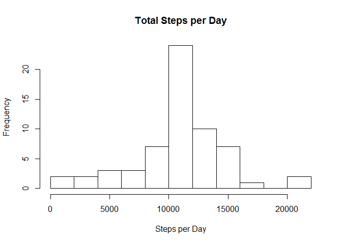

# Reproducible Research: Peer Assessment 1


## Loading and preprocessing the data
We are using data from a personal activity monitoring device which has collected number of steps by 5 minute intervals over October and November 2012.

Data was found here:
  [Activity Monitoring Data](https://d396qusza40orc.cloudfront.net/repdata%2Fdata%2Factivity.zip)
  
Download data and unzip to working directory.

```r
Data <- tempfile()
download.file("http://d396qusza40orc.cloudfront.net/repdata%2Fdata%2Factivity.zip",Data)
unzip(Data)
```
Read Data into R.

```r
Activity <- read.csv("activity.csv")
```


## What is mean total number of steps taken per day?

Create Histogram of total steps per day.

```r
sumsteps <- aggregate(Activity$steps,list(Activity$date),sum)
colnames(sumsteps)<-(c("Date","Total"))
hist(sumsteps$Total,
     breaks=10,
     main="Total Steps per Day",
     xlab="Steps per Day"
     )
```

 

Calculate mean and median steps per day.

```r
meansteps <- format(mean(sumsteps$Total,na.rm=TRUE),scientific=FALSE,nsmall=3)
mediansteps <- median(sumsteps$Total,na.rm=TRUE)
```
Mean steps per day is: 10766.189  
Median steps per day is: 10765  

## What is the average daily activity pattern?
Take an average of steps in each 5-minute interval across days. And Plot them in a time series.

```r
avgsteps <- aggregate(Activity$steps,list(Activity$interval),mean,na.rm = TRUE)
colnames(avgsteps)<-(c("interval","Average"))

plot(avgsteps$interval,avgsteps$Average,
     type='l',
     xlab="Interval",
     ylab="Average Steps",
     main="Average Daily Activity Pattern",
     xaxt="n",
     las=2
     )

axis(side = 1, at = seq(0,2300,by=100),las=2,labels = T)
```

 

```r
max <- avgsteps[avgsteps$Average==max(avgsteps$Average),]
maxinterval<-max$interval
maxaverage<-max$Average
```
Interval 835 on average contains the maximum number of steps at 206.1698 steps.

## Imputing missing values

```r
count_na <- sum(!is.na(Activity$steps))
```
There are 15264 missing values in the dataset.
In order to fill in the missing values, the method of inserting the average steps for that 5-minute interval will be used. The average is rounded as you can't have a partial step.

```r
#add average to each interval using merge
newActivity<-merge(Activity,avgsteps,by="interval",all.x=TRUE)
newActivity$steps[is.na(newActivity$steps)]<-ceiling(newActivity$Average[is.na(newActivity$steps)])
newActivity$Average<-NULL

sumsteps2 <- aggregate(newActivity$steps,list(newActivity$date),sum)
colnames(sumsteps2)<-(c("Date","Total"))
hist(sumsteps2$Total,
     breaks=10,
     main="Total Steps per Day",
     xlab="Steps per Day"
     )
```

 
Calculate mean and median steps per day.

```r
meansteps2 <- format(mean(sumsteps2$Total,na.rm=TRUE),scientific=FALSE,nsmall=3)
mediansteps2 <- format(median(sumsteps2$Total,na.rm=TRUE),scientific=FALSE)
meandiff<-as.numeric(meansteps2)-as.numeric(meansteps)
mediandiff<-as.numeric(mediansteps2)-as.numeric(mediansteps)
```
Mean steps per day is: 10784.918  
Median steps per day is: 10909  

When comparing mean to the first part, there is not a significant difference (18.729) between these numbers. So there is little to no impact of imputing missing values on the mean estimate of total daily number of steps.

When comparing median to the first part, there is a significant difference (144) between these numbers. So there is a large impact when imputing missing values on the median estimate of total daily number of steps due to the nature of the median calculation.


## Are there differences in activity patterns between weekdays and weekends?
Add a new factor variable indicating whether the date is a weekend or weekday.

```r
newActivity$weekend <- as.factor(as.POSIXlt(newActivity$date, format='%Y-%m-%d')$wday %in% c(0, 6))
levels(newActivity$weekend) <- c("weekday","weekend")

avgsteps2 <- aggregate(newActivity$steps,list(newActivity$interval,newActivity$weekend),mean,na.rm = TRUE)
colnames(avgsteps2)<-(c("interval","weekpart","Average"))

library(ggplot2)
```

```
## Warning: package 'ggplot2' was built under R version 3.1.2
```

```r
g<-ggplot(avgsteps2,aes(interval,Average))
g + geom_line() + facet_wrap(~ weekpart,nrow=2) +
  scale_x_continuous(breaks=seq(0,2300,by=100)) +
  theme(axis.text.x = element_text(angle = 90, vjust = .5)) +
  labs(y="Average number of steps")
```

 

Activity on the weekend appears to start later in the morning, but the pattern throughout the day is higher overall than on weekdays.  
  
    
      
